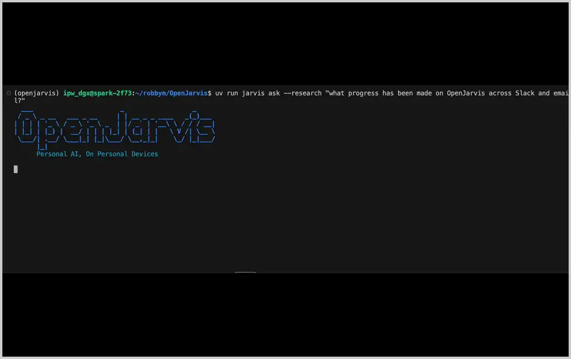

<div align="center">
  

  <p><i>Personal AI, On Personal Devices.</i></p>

  <p>
    <a href="https://github.com/open-jarvis/OpenJarvis"></a>
    <a href="https://arxiv.org/abs/2605.17172"></a>
    <a href="https://kmahendra999.github.io/nira/"></a>
    
    
  </p>
</div>

---

<div align="center">
  
</div>

---

> **[Documentation](https://kmahendra999.github.io/nira/)**
>
> **[Project Site](https://kmahendra999.github.io/nira/)**
>
> **[Paper](https://arxiv.org/abs/2605.17172)**
>
> **[Leaderboard](https://kmahendra999.github.io/nira/leaderboard/)**
>
> **[Roadmap](https://kmahendra999.github.io/nira/development/roadmap/)**

## Why Nira?

Personal AI agents are exploding in popularity, but nearly all of them still route intelligence through cloud APIs. Your "personal" AI continues to depend on someone else's server. At the same time, the [Intelligence Per Watt](https://www.intelligence-per-watt.ai/) research showed that local language models already handle 88.7% of single-turn chat and reasoning queries, with intelligence efficiency improving 5.3× from 2023 to 2025. The models and hardware are increasingly ready. What has been missing is the software stack to make local-first personal AI practical.

Nira is that stack. It is a framework for local-first personal AI, built around three core ideas: shared primitives for building on-device agents; evaluations that treat energy, FLOPs, latency, and dollar cost as first-class constraints alongside accuracy; and a learning loop that improves models using local trace data. The goal is simple: make it possible to build personal AI agents that run locally by default, calling the cloud only when truly necessary. Nira aims to be both a research platform and a production foundation for local AI, in the spirit of PyTorch.

## Installation

Pick your platform and run one command. Each installer handles [uv](https://docs.astral.sh/uv/), the Python venv, Ollama, and a starter model — about 3 minutes on broadband.

| Platform | One-liner |
|---|---|
| **macOS · Linux · WSL2** | `curl -fsSL https://kmahendra999.github.io/nira/install.sh \| bash` |
| **Native Windows** | `irm https://kmahendra999.github.io/nira/install.ps1 \| iex` |
| **Desktop GUI** | Download `.exe` / `.dmg` / `.deb` / `.rpm` / `.AppImage` from the [latest release](https://github.com/kmahendra999/nira/releases) |

Then `nira` to start. The Rust extension and larger models continue downloading in the background; `nira doctor` shows status.

Platform-specific notes (WSL2 setup, native-Windows scheduled-task service, desktop prerequisites, manual / contributor install): see the [installation docs](https://kmahendra999.github.io/nira/getting-started/install/).

## Quick Start

```bash
nira                          # start chatting (default: chat-simple)
nira init --preset <name> --force  # replace config with a starter preset
```

> Prefix `nira ...` with `uv run`, or `source .venv/bin/activate` first.

| Preset | What it does |
|---|---|
| `morning-digest-mac` / `morning-digest-linux` / `morning-digest-minimal` | Spoken daily briefing from email, calendar, health, news |
| `deep-research` | Multi-hop research across indexed docs with citations |
| `code-assistant` | Agent with code execution, file I/O, and shell access |
| `scheduled-monitor` | Stateful agent on a schedule with memory |
| `chat-simple` | Lightweight conversation, no tools |

Example:

```bash
nira init --preset morning-digest-mac --force
nira connect gdrive          # one OAuth covers Gmail / Calendar / Tasks
nira digest --fresh          # generate and play your first briefing
```

Per-preset deep dives: [morning digest](https://kmahendra999.github.io/nira/user-guide/morning-digest/) · [deep research](https://kmahendra999.github.io/nira/user-guide/deep-research/) · [code assistant](https://kmahendra999.github.io/nira/user-guide/code-assistant/) · [scheduled monitor](https://kmahendra999.github.io/nira/user-guide/scheduled-monitor/) · [chat simple](https://kmahendra999.github.io/nira/user-guide/chat-simple/) · or the full [quickstart guide](https://kmahendra999.github.io/nira/getting-started/quickstart/).

### Skills

Skills teach agents how to better use tools and improve their reasoning. Every skill is a tool — agents discover them from a catalog and invoke them on demand.

```bash
# Install skills from public sources
nira skill install hermes:arxiv
nira skill sync hermes --category research

# Use skills with any agent
nira ask "Use the code-explainer skill to explain this Python code: for i in range(5): print(i*2)"

# Optimize skills from your trace history
nira optimize skills --policy dspy

# Benchmark the impact
nira bench skills --max-samples 5 --seeds 42
```

Import from [Hermes Agent](https://github.com/NousResearch/hermes-agent) (~150 skills), [OpenClaw](https://github.com/openclaw/skills) (~13,700 community skills), or any GitHub repo. Skills follow the [agentskills.io](https://agentskills.io/specification) open standard.

See the [Skills User Guide](https://kmahendra999.github.io/nira/user-guide/skills/) and [Skills Tutorial](https://kmahendra999.github.io/nira/tutorials/skills-workflow/) for details.

### Built-in Agents

Nira ships with eight built-in agents across three execution modes (on-demand, scheduled, continuous):

| Agent | Type | What it does |
|-------|------|-------------|
| `morning_digest` | Scheduled | Daily briefing from email, calendar, health, news — with TTS audio |
| `deep_research` | On-demand | Multi-hop research with citations across web and local docs |
| `monitor_operative` | Continuous | Long-horizon monitoring with memory, compression, and retrieval |
| `orchestrator` | On-demand | Multi-turn reasoning with automatic tool selection |
| `native_react` | On-demand | ReAct (Thought-Action-Observation) loop agent |
| `operative` | Continuous | Persistent autonomous agent with state management |
| `native_openhands` | On-demand | CodeAct — generates and executes Python code |
| `simple` | On-demand | Single-turn chat, no tools |

See the [User Guide](https://kmahendra999.github.io/nira/user-guide/morning-digest/) and [Tutorials](https://kmahendra999.github.io/nira/tutorials/) for detailed setup instructions.

Full documentation — including Docker deployment, cloud engines, development setup, and tutorials — at **[kmahendra999.github.io/nira](https://kmahendra999.github.io/nira/)**.

## Community

- **GitHub:** [github.com/kmahendra999/nira](https://github.com/kmahendra999/nira)

## Contributing

We welcome contributions! See the [Contributing Guide](CONTRIBUTING.md) for incentives, contribution types, and the PR process.

Quick start for contributors:

```bash
git clone https://github.com/kmahendra999/nira.git
cd Nira
uv sync --extra dev
uv run pre-commit install
uv run pytest tests/ -v
```

Browse the [Roadmap](https://kmahendra999.github.io/nira/development/roadmap/) for areas where help is needed. Comment **"take"** on any issue to get auto-assigned.

## About

Nira is a fork of [OpenJarvis](https://github.com/open-jarvis/OpenJarvis), the local-first personal
AI framework developed at [Hazy Research](https://hazyresearch.stanford.edu/) and the
[Scaling Intelligence Lab](https://scalingintelligence.stanford.edu/) at
[Stanford SAIL](https://ai.stanford.edu/) as part of
[Intelligence Per Watt](https://www.intelligence-per-watt.ai/). The five-primitive architecture,
the energy-aware evaluation harness, and the trace-driven learning loop are all their work, and
Nira continues to track their security fixes.

Nira diverges in what it is *for*: a personal assistant you run across your own machines — a
device mesh over Tailscale, an Android client, a conversational voice runtime, and autonomous
work on your own projects with live progress you can watch from your phone.

## Citation

Nira builds on OpenJarvis. If you use this work academically, cite their paper:

```bibtex
@misc{saadfalcon2026openjarvispersonalaipersonal,
      title={OpenJarvis: Personal AI, On Personal Devices}, 
      author={Jon Saad-Falcon and Avanika Narayan and Robby Manihani and Tanvir Bhathal and Herumb Shandilya and Hakki Orhun Akengin and Gabriel Bo and Andrew Park and Matthew Hart and Caia Costello and Chuan Li and Christopher Ré and Azalia Mirhoseini},
      year={2026},
      eprint={2605.17172},
      archivePrefix={arXiv},
      primaryClass={cs.LG},
      url={https://arxiv.org/abs/2605.17172}, 
}
```

## License

[Apache 2.0](LICENSE)
