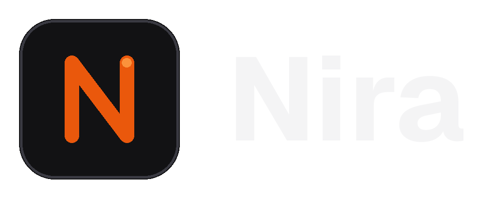

<div align="center">
  

  <p><i>Personal AI, On Personal Devices.</i></p>

  <p>
    <a href="https://github.com/open-jarvis/OpenJarvis"></a>
    <a href="https://arxiv.org/abs/2605.17172"></a>
    <a href="https://github.com/kmahendra999/nira/blob/main/docs/index.md"></a>
    
    
  </p>
</div>

---

> **[Documentation](https://github.com/kmahendra999/nira/blob/main/docs/index.md)**
>
> **[Project Site](https://github.com/kmahendra999/nira/blob/main/docs/index.md)**
>
> **[Paper](https://arxiv.org/abs/2605.17172)**
>
> **[Leaderboard](https://github.com/kmahendra999/nira/blob/main/docs/leaderboard.md)**
>
> **[Roadmap](https://github.com/kmahendra999/nira/blob/main/docs/development/roadmap.md)**

## Why Nira?

Most "personal" AI still routes your most personal data through someone else's server. Nira runs
on hardware you own, and the cloud is an option rather than a dependency.

What Nira is for:

- **Your machines, as one assistant.** Several desktops — Linux, macOS, Windows — linked over
  Tailscale, each with its own key and scopes, so a phone that can approve a task cannot
  administer the mesh.
- **Your phone as the way in.** An Android client that talks to a paired desktop: speak a command,
  watch the run in progress, and answer an approval from the lock screen. The data stays on the
  desktop; the phone is a terminal onto it.
- **Voice that holds a conversation**, rather than one-shot dictation.
- **Autonomous work on real projects.** Point an agent at a directory and it edits files, runs
  commands and reports back — with live progress you can follow from wherever you are.
- **Approvals before anything risky.** Anything that touches your files or runs a command can stop
  and ask first.

Underneath that is the framework it was forked from: composable primitives for on-device agents,
evaluations that treat energy, FLOPs, latency and cost as first-class constraints alongside
accuracy, and a learning loop that improves prompts and routing from local traces.

## Installation

Pick your platform and run one command. Each installer handles [uv](https://docs.astral.sh/uv/), the Python venv, Ollama, and a starter model — about 3 minutes on broadband.

| Platform | One-liner |
|---|---|
| **macOS · Linux · WSL2** | `curl -fsSL https://raw.githubusercontent.com/kmahendra999/nira/main/scripts/install/install.sh \| bash` |
| **Native Windows** | `irm https://raw.githubusercontent.com/kmahendra999/nira/main/deploy/windows/install.ps1 \| iex` |
| **Desktop GUI** | No published binary yet — build it: `cd frontend && npm install && npm run tauri build` |

Then `nira` to start. The Rust extension and larger models continue downloading in the background; `nira doctor` shows status.

Platform-specific notes (WSL2 setup, native-Windows scheduled-task service, desktop prerequisites, manual / contributor install): see the [installation docs](https://github.com/kmahendra999/nira/blob/main/docs/getting-started/install.md).

## Quick Start

```bash
nira                          # start chatting (default: chat-simple)
nira init --preset <name> --force  # replace config with a starter preset
```

> Prefix `nira ...` with `uv run`, or `source .venv/bin/activate` first.

| Preset | What it does |
|---|---|
| `morning-digest-mac` / `morning-digest-linux` / `morning-digest-minimal` | Spoken daily briefing from email, calendar, health, news |
| `deep-research` | Multi-hop research across indexed docs with citations |
| `code-assistant` | Agent with code execution, file I/O, and shell access |
| `scheduled-monitor` | Stateful agent on a schedule with memory |
| `chat-simple` | Lightweight conversation, no tools |

Example:

```bash
nira init --preset morning-digest-mac --force
nira connect gdrive          # one OAuth covers Gmail / Calendar / Tasks
nira digest --fresh          # generate and play your first briefing
```

Per-preset deep dives: [morning digest](https://github.com/kmahendra999/nira/blob/main/docs/user-guide/morning-digest.md) · [deep research](https://github.com/kmahendra999/nira/blob/main/docs/user-guide/deep-research.md) · [code assistant](https://github.com/kmahendra999/nira/blob/main/docs/user-guide/code-assistant.md) · [scheduled monitor](https://github.com/kmahendra999/nira/blob/main/docs/user-guide/scheduled-monitor.md) · [chat simple](https://github.com/kmahendra999/nira/blob/main/docs/user-guide/chat-simple.md) · or the full [quickstart guide](https://github.com/kmahendra999/nira/blob/main/docs/getting-started/quickstart.md).

### Skills

Skills teach agents how to better use tools and improve their reasoning. Every skill is a tool — agents discover them from a catalog and invoke them on demand.

```bash
# Install skills from public sources
nira skill install hermes:arxiv
nira skill sync hermes --category research

# Use skills with any agent
nira ask "Use the code-explainer skill to explain this Python code: for i in range(5): print(i*2)"

# Optimize skills from your trace history
nira optimize skills --policy dspy

# Benchmark the impact
nira bench skills --max-samples 5 --seeds 42
```

Import from [Hermes Agent](https://github.com/NousResearch/hermes-agent) (~150 skills), [OpenClaw](https://github.com/openclaw/agent-skills), or any GitHub repo. Skills follow the [agentskills.io](https://agentskills.io/specification) open standard.

See the [Skills User Guide](https://github.com/kmahendra999/nira/blob/main/docs/user-guide/skills.md) and [Skills Tutorial](https://github.com/kmahendra999/nira/blob/main/docs/tutorials/skills-workflow.md) for details.

### Built-in Agents

Nira ships with eight built-in agents across three execution modes (on-demand, scheduled, continuous):

| Agent | Type | What it does |
|-------|------|-------------|
| `morning_digest` | Scheduled | Daily briefing from email, calendar, health, news — with TTS audio |
| `deep_research` | On-demand | Multi-hop research with citations across web and local docs |
| `monitor_operative` | Continuous | Long-horizon monitoring with memory, compression, and retrieval |
| `orchestrator` | On-demand | Multi-turn reasoning with automatic tool selection |
| `native_react` | On-demand | ReAct (Thought-Action-Observation) loop agent |
| `operative` | Continuous | Persistent autonomous agent with state management |
| `native_openhands` | On-demand | CodeAct — generates and executes Python code |
| `simple` | On-demand | Single-turn chat, no tools |

See the [User Guide](https://github.com/kmahendra999/nira/blob/main/docs/user-guide/morning-digest.md) and [Tutorials](https://github.com/kmahendra999/nira/blob/main/docs/tutorials/) for detailed setup instructions.

Full documentation — including Docker deployment, cloud engines, development setup, and tutorials — is in **[docs/](https://github.com/kmahendra999/nira/tree/main/docs)**.

## Community

- **GitHub:** [github.com/kmahendra999/nira](https://github.com/kmahendra999/nira)

## Contributing

We welcome contributions! See the [Contributing Guide](CONTRIBUTING.md) for incentives, contribution types, and the PR process.

Quick start for contributors:

```bash
git clone https://github.com/kmahendra999/nira.git
cd Nira
uv sync --extra dev
uv run pre-commit install
uv run pytest tests/ -v
```

Browse the [Roadmap](https://github.com/kmahendra999/nira/blob/main/docs/development/roadmap.md) for areas where help is needed. Comment **"take"** on any issue to get auto-assigned.

## About

Nira is a personal assistant you run across your own machines. A device mesh over Tailscale, an
Android client, a conversational voice runtime, and autonomous work on your own projects with
live progress you can watch from your phone. Models, agents, tools and memory all run on hardware
you own; the cloud is an option, not a dependency.

Built on [OpenJarvis](https://github.com/open-jarvis/OpenJarvis), an Apache-2.0 local-first AI
framework from Stanford SAIL, whose security fixes Nira tracks.

## Citation

Nira has no paper of its own. Academic work building on the framework underneath it should cite
the upstream project, which publishes its citation at
[github.com/open-jarvis/OpenJarvis](https://github.com/open-jarvis/OpenJarvis).

## License

[Apache 2.0](LICENSE)
